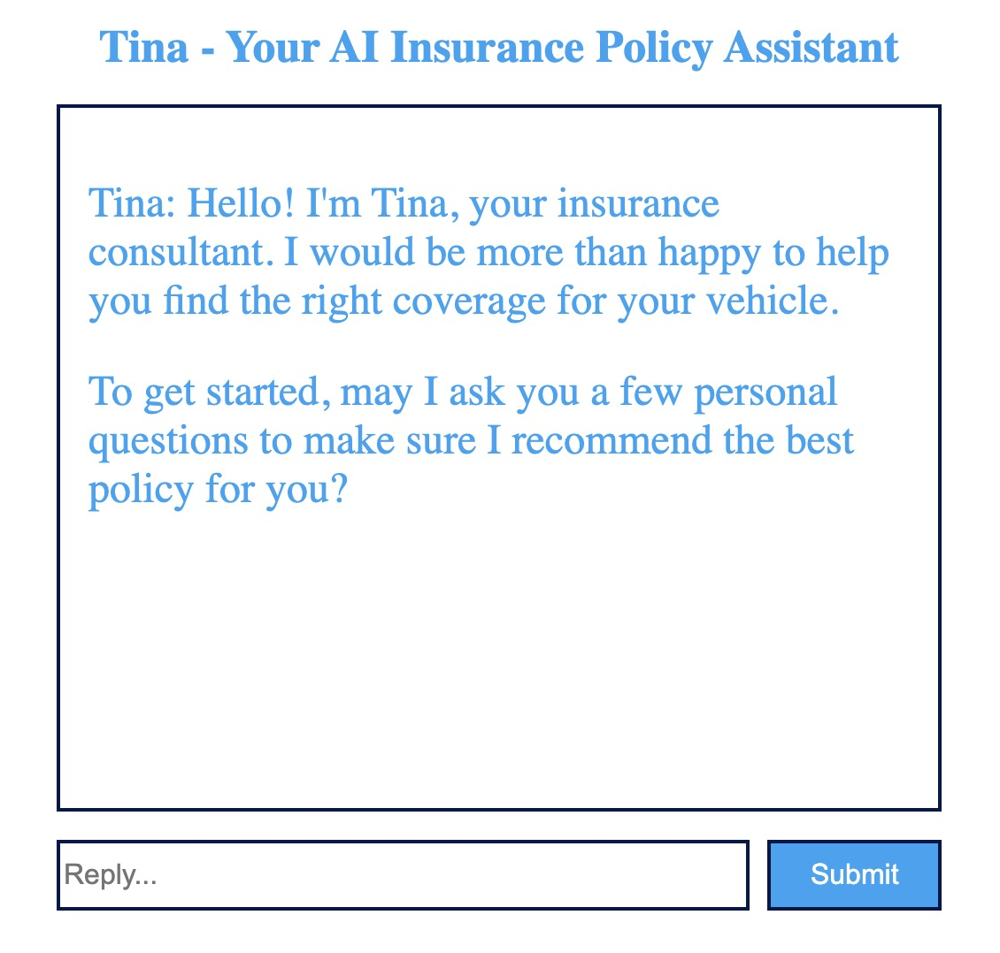
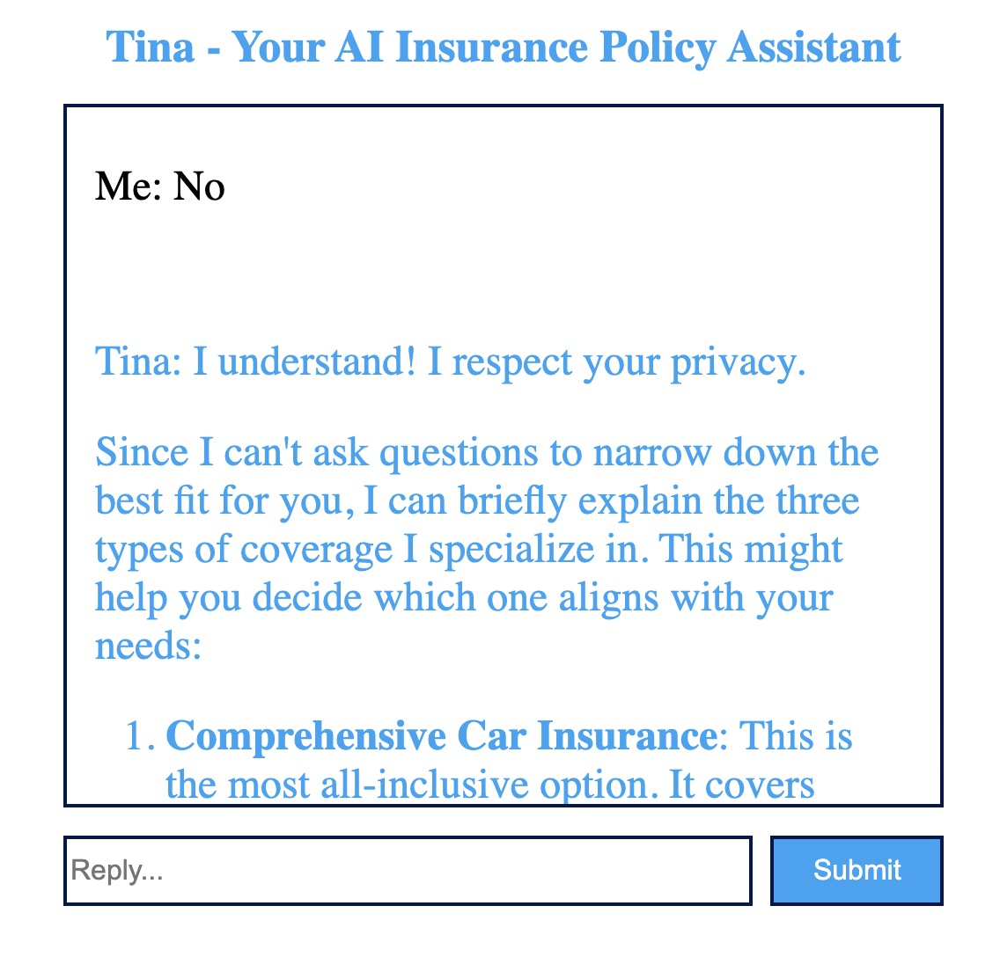
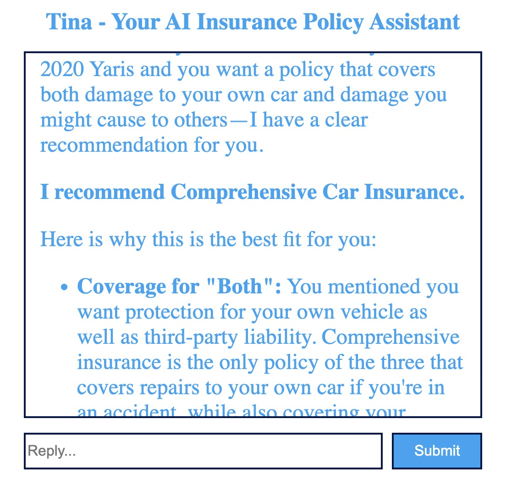

# Mission 4 Readme

The AI car insurance recommendation applicion chats with a user and recommend the suitable insurnace policy based on user reponses. The user opens the website, and AI consultant Tina start introducing herself and ask permission to asking questions. After the user answers a set of questions, system analyzes the data and generates personalized insurance recommendations.

Frontend: React + Vite

Backend: Node.js + Express

AI Processing: Google Gemini

Deployment: Docker Containers


## Installation

Docker build:

```bash
docker-compose up --build
```

Local development:

Backend:
```bash
cd backend
npm run dev
```
Frontend:
```bash
cd frontend
npm run dev
```
## More Details

    



## Contributors

Xiaoyan Cheng: https://github.com/Xiaowudu